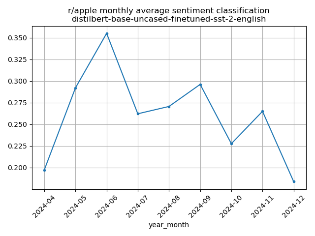

Here’s your updated README with the new CLI script and revised project structure, while keeping your original tone and goals:

---

# Reddit Sentiment Monitor

This project tracks Reddit sentiment over time for specific subreddits or brands, starting with `r/apple`. It uses the Reddit API to pull top posts, applies a pre-trained sentiment analysis model, and visualizes sentiment trends. The goal is to eventually detect shifts (drift), build a real-time dashboard, and deploy the tool publicly.

---

## Current features 

- **Reddit Scraper CLI**:
  - Modular Python script: `sentiment_tracker.py`
  - Pulls top posts based on user-defined `subreddit`, `time_filter`, and `limit`
  - Stores relevant metadata: `created_at`, `retrieved_at`, `title`, `selftext`, `score`, `num_comments`
  - Supports CLI arguments or config file for automation
  - Exports `.csv` of scraped + scored data
  - Saves final sentiment trend plot with identifying filename
  - Logs current Reddit API rate limit after each run

- **Sentiment Scoring**:
  - Uses Hugging Face model [`distilbert-base-uncased-finetuned-sst-2-english`](https://huggingface.co/distilbert-base-uncased-finetuned-sst-2-english)
  - Scores each post with `positive` or `negative`
  - Aggregates sentiment per month and plots trend over time

---

## 🧪 How to Run

### CLI Script (recommended)
```bash
python sentiment_tracker.py --subreddit apple --time_filter year --limit 1000
```

This will:
- Scrape the top posts from `r/apple`
- Analyze sentiment
- Output:
  - `data/apple_tf-year_n-1000_<timestamp>.csv`
  - `data/apple_tf-year_n-1000_<timestamp>.png`

### Optional: Config File
You can also define a config `.yaml` file (coming soon) for automation or scheduled runs.

---

## Example output

### Sentiment prediction

Below is a sample output of a negative sentiment prediction of a post created May 2024:

| subreddit | created<br>at      | retrieved<br>at     | type | text               | score | num<br>comments | logit<br>negative | logit<br>positive | predicted<br>sentiment | predicted<br>label |
|-----------|--------------------|----------------------|------|--------------------|--------|------------------|--------------------|--------------------|-------------------------|---------------------|
| apple     | 2024-05-16 17:09   | 2025-04-12 11:12     | post | iMessage is Down   | 1761   | 205              | 4.49               | -3.69              | 0                       | negative            |

### Trend analysis

Below is a sample output showing sentiment trend in `r/apple` based on top posts from the past year:



The x-axis shows each month, and the y-axis is the **average sentiment score** (1 = positive, 0 = negative).

---

## Project Structure

```bash
.
├── sentiment_tracker.py           # Main CLI pipeline for scraping, scoring, and plotting
├── data/                          # Stores CSV and PNG outputs
│   └── apple_tf-year_n-1000_*.csv
│   └── apple_tf-year_n-1000_*.png
├── notebooks/                     # Legacy prototype notebooks
│   └── get_reddit_posts.ipynb     
│   └── analyze_sentiment.ipynb
├── README.md                      # You're reading it
```

---

## Coming Soon
- Daily automation & cron-compatible config
- Dashboard deployment (Streamlit or Grafana)
- LLM-based custom sentiment labels
- Drift detection alerts
