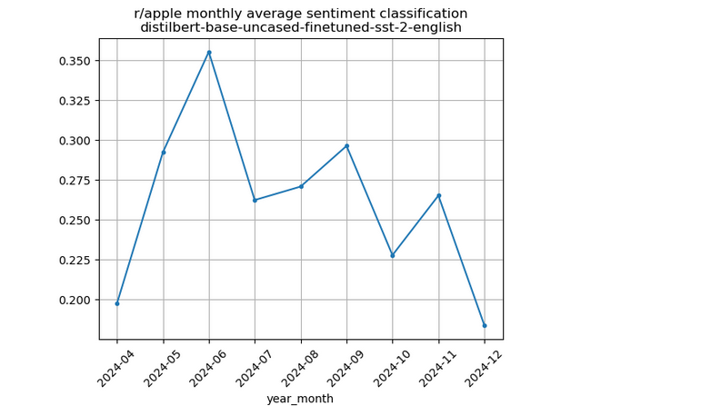

# 🧠 Reddit Brand Sentiment Monitor

This project tracks Reddit sentiment over time for specific subreddits or brands, starting with `r/apple`. It uses the Reddit API to pull top posts, applies a pre-trained sentiment analysis model, and visualizes sentiment trends. The goal is to eventually detect shifts (drift), build a real-time dashboard, and deploy the tool publicly.

---

## 📌 Project Features (Current Phase)

### ✅ Implemented:
- **Reddit Scraper** using PRAW:
  - Pulls top posts (e.g. top 1000 from the past year)
  - Stores relevant metadata: `created_at`, `retrieved_at`, `title`, `selftext`, `score`, `num_comments`
- **Sentiment Scoring**:
  - Uses Hugging Face model [`distilbert-base-uncased-finetuned-sst-2-english`](https://huggingface.co/distilbert-base-uncased-finetuned-sst-2-english)
  - Calculates average sentiment score per post and visualizes monthly trends

---

## 📊 Example Output

Below is a sample output showing sentiment trend in `r/apple` based on top posts from the past year:



The x-axis shows each month, and the y-axis is the **average sentiment score** (1 = positive, 0 = negative).

---

## 🗂 Project Structure

```bash
.
├── reddit.ipynb       # Pulls top Reddit posts using PRAW and formats them for analysis
├── sentiment.ipynb    # Applies sentiment analysis and generates visualizations
├── apple.png          # Sentiment trend plot for r/apple
├── requirements.txt   # (coming soon) Python dependencies
├── README.md          # You're reading it
